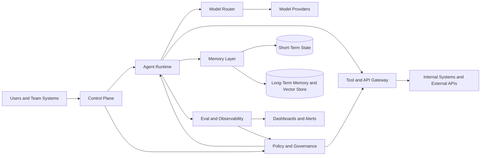

# Platform Architecture Blueprint

## 1) Executive Summary
This blueprint defines a general-purpose, team-guided, self-improving agent platform with an enterprise-ready baseline for reliability, security, and governance.

Current program defaults:
- Core runtime: `LangGraph` (Python).
- Optional secondary framework: `Semantic Kernel` (integration layer, not co-orchestrator in v1).
- Provider: `OpenAI` only in v1.
- Hosting: self-hosted in private AWS environment.

Default v1 boundary:
- The platform may propose and evaluate improvements.
- The platform may not auto-apply production self-code changes without explicit human approval.

## 2) Reference Architecture (Provider-Agnostic, Self-Hosted-First)


Core subsystems:
- `Control Plane`: lifecycle management, config rollout, tenant isolation, approvals.
- `Agent Runtime`: orchestrates plans, tools, memory, and execution checkpoints.
- `Model Router`: provider-agnostic policy routing, fallback, and cost/latency policy.
- `Tool and API Gateway`: least-privilege tool execution, secrets isolation, egress policy.
- `Memory Layer`: short-term working state plus long-term memory and retrieval.
- `Eval and Observability`: traces, eval runs, drift detection, SLO alerts.
- `Policy and Governance`: hard safety policy, risk policy, and approval workflows.

Architecture review update:
- `LangGraph` should remain the only v1 orchestrator. `Semantic Kernel` should be evaluated later only if it removes repeated integration work.
- The tool gateway must treat MCP outputs as untrusted data, not instructions.
- Runtime state and audit state must be separate so context compression cannot destroy forensic records.

## 3) Public Interfaces (Proposed v1)
### 3.1 Control Plane API
- `POST /v1/agents`: register agent profile and policy bindings.
- `POST /v1/runs`: start run with user/task input.
- `POST /v1/runs/{id}/approve`: approve gated action or patch.
- `POST /v1/runs/{id}/rollback`: rollback active configuration to last known good.

### 3.2 Runtime Event Contract
```json
{
  "run_id": "uuid",
  "agent_id": "string",
  "event_type": "plan|tool_call|policy_check|eval_result|approval_request|deploy|rollback",
  "timestamp": "RFC3339",
  "payload": {},
  "risk_level": "low|medium|high|critical",
  "trace_id": "string"
}
```

### 3.3 Policy Decision Interface
```json
{
  "input": {
    "action": "tool_call|config_change|deploy",
    "context": {},
    "risk_level": "low|medium|high|critical"
  },
  "output": {
    "decision": "allow|deny|require_approval",
    "reasons": ["string"],
    "controls_required": ["string"]
  }
}
```

## 4) Safe Self-Improvement Loop
1. `Propose`: agent proposes prompt/policy/tool-config change with expected KPI impact.
2. `Sandbox`: run offline evals and constrained replay tests.
3. `Policy Check`: enforce security, privacy, and compliance checks.
4. `Human Approval`: require owner approval for medium+ risk changes.
5. `Staged Rollout`: canary rollout with blast-radius limits.
6. `Observe`: monitor regression, incident, and cost drift.
7. `Rollback`: auto or manual rollback to last known good.

## 5) Reliability Engineering Baseline
| Area | v1 Pattern | Primary Metric | Owner | Effort | Prerequisites |
|---|---|---|---|---|---|
| External model/API calls | Retries with bounded backoff + timeout budgets | P95 latency, timeout rate | Platform Eng | M | Centralized client wrappers |
| Tool execution | Circuit breakers + fallback policy | Tool error rate, open-circuit count | Runtime Eng | M | Tool registry |
| Task execution | Idempotent run/task IDs | Duplicate side-effect rate | Runtime Eng | M | Persistent run ledger |
| Throughput control | Queue + backpressure + admission control | Queue depth, dropped requests | SRE | M | Message broker |
| State durability | Checkpoint per critical step | Resume success rate | Runtime Eng | M | Durable store |
| Incident containment | Cell/tenant isolation | Blast radius per incident | SRE/SecOps | L | Tenant model |
| Recovery | RTO/RPO objectives + tested restore | RTO, RPO, restore pass rate | SRE | M | Backup automation |

## 6) Security and Compliance Baseline (SOC2/GDPR Mapped)
| Control Objective | Platform Control | SOC 2 TSC Area | GDPR Mapping | Owner | Effort | Prerequisites |
|---|---|---|---|---|---|---|
| Strong identity and access | SSO, RBAC, least privilege, JIT access | Security, Confidentiality | Art. 5(1)(f), Art. 32 | Security Eng | M | IdP integration |
| Secret protection | Vault-backed secrets, no raw key injection to prompts | Security | Art. 25, Art. 32 | Security Eng | M | Secrets manager |
| Data minimization and retention | Memory TTL, retention classes, delete workflows | Privacy, Confidentiality | Art. 5(1)(c), Art. 5(1)(e), Art. 17 | Data Gov | M | Data catalog |
| Network and egress control | Private networking, allowlisted egress, DNS policy | Security, Availability | Art. 32 | Platform/SecOps | M | Network policy engine |
| Auditability | Immutable run/tool/policy logs | Processing Integrity, Security | Art. 5(2), Art. 30 | SecOps | M | Central log pipeline |
| Change governance | Approval gates, policy-as-code, signed releases | Security, Processing Integrity | Art. 24, Art. 25 | Platform + Compliance | M | CI/CD controls |
| Incident response | Security playbooks, containment, notification process | Security, Availability | Art. 33, Art. 34 | SecOps | M | On-call process |

## 7) Critical Ingredients Missing Today (What Must Be Built First)
| Gap | Why It Is Critical | Owner | Effort | Dependency |
|---|---|---|---|---|
| Unified policy engine | Needed to enforce safety and approval decisions consistently | Platform + Security | M | Risk taxonomy |
| Evaluation harness with replay datasets | Needed to detect regressions before rollout | Applied AI + QA | M | Baseline datasets |
| Memory governance model | Needed for deletion, retention, and privacy boundaries | Data Gov + Platform | M | Data classification |
| Tool permission model | Needed to prevent tool abuse and lateral movement | Security Eng | M | Tool registry |
| Observability + trace schema | Needed for root cause analysis and compliance evidence | SRE + Platform | M | Event contract |
| Release and rollback pipeline | Needed for safe staged improvement | Platform Eng | M | CI/CD + artifact signing |

## 8) Acceptance Checklist for This Blueprint
- Architecture covers control plane, runtime, memory, tool/API gateway, eval/observability, and governance.
- Self-improvement lifecycle includes proposal, evaluation, approval, rollout, and rollback.
- Reliability patterns define measurable operational signals.
- Security baseline maps to SOC2/GDPR objectives.
- Each recommendation includes owner, effort, and dependency.

## 9) Session Protocol and Loop Contract (v2 Update)
### 9.1 Inbound Message Types
- `init`: starts a new task session.
- `feedback`: provides user corrections, missing data, or rejection/adjustment.
- `accept`: marks final acceptance and ends active execution loop.

### 9.2 Outbound Message Types
- `final`: agent has sufficient information and returns a complete result.
- `question`: agent needs more information to proceed safely/correctly.
- `error_retryable`: temporary model/tool/runtime failure with retry guidance.
- `error_policy`: action blocked by policy.
- `error_tool`: MCP/tool failure that needs user or operator action.
- `error_fatal`: unrecoverable session failure.

### 9.3 Session State Machine
`NEW -> RUNNING -> WAITING_HUMAN -> RUNNING -> ... -> COMPLETED`

Rules:
- `init` transitions `NEW` to `RUNNING`.
- `question` transitions to `WAITING_HUMAN`.
- `feedback` transitions back to `RUNNING`.
- `final` transitions to `WAITING_HUMAN` until either `accept` or new `feedback`.
- `accept` transitions to `COMPLETED` and triggers asynchronous reflection.
- `error_retryable` preserves session state and consumes retry budget.
- `error_policy` waits for changed input or human/operator approval.
- `error_fatal` transitions to `FAILED`.

### 9.4 Core Session Envelope
```json
{
  "session_id": "uuid",
  "message_id": "uuid",
  "state_version": 12,
  "agent_id": "proposal_writer|project_selector|keyword_extractor",
  "message_type": "init|feedback|accept",
  "payload": {},
  "user_id": "string",
  "nonce": "string",
  "timestamp": "RFC3339"
}
```

## 10) Context Window Strategy (v2 Update)
Use structured context assembly, not full transcript replay.

Required context layers:
1. System invariants: policy, tool constraints, output schemas.
2. Active working set: latest turns, unresolved questions, latest feedback.
3. Session memory summary: compact decisions, constraints, preferences, accepted/rejected outputs.
4. On-demand retrieval: fetch only relevant prior traces by semantic + metadata search.

Token pressure policy:
- Drop old raw tool payloads first.
- Drop verbose intermediate traces second.
- Keep latest human feedback, unresolved constraints, and policy constraints at all times.

Implementation pattern:
- `audit_log`: immutable full trace for compliance and forensic analysis.
- `model_context_log`: compressed and curated context sent to model.

## 11) Confidence and Anti-Hallucination Contract (v2 Update)
Every `final` and `question` output must include:
- `confidence_score` (`0.0` to `1.0`)
- `confidence_band` (`low|medium|high`)
- `confidence_basis` (structured evidence signals)

Confidence computation inputs:
- retrieval coverage/relevance score
- unresolved constraint count
- tool-call success ratio
- verifier consistency check
- historical acceptance for similar tasks

Policy gates:
- `high`: normal final response allowed.
- `medium`: final response plus explicit verification notice.
- `low`: force `question` or manual review path.

## 12) Reflection Pipeline After Accept (v2 Update)
On `accept`, run asynchronous improvement workflow:
1. Persist session trace and derived summary.
2. Extract candidate improvements (prompt, retrieval, policy tuning, tool routing).
3. Evaluate candidates on replay/eval datasets.
4. Promote only if quality improves and safety regressions are zero.
5. Require human approval for medium/high-risk promotions.

Out of scope for v1:
- autonomous production code self-modification without approval.

## 13) Architecture Review Findings and Recovery Paths
| Finding | Risk | Required Improvement |
|---|---|---|
| Reflection can learn from noisy or adversarial feedback | Gradual quality/security regression | Quarantine candidate changes and require eval pass before promotion |
| Context compression can drop important constraints | Wrong output or repeated questions | Hard-pin latest feedback, unresolved constraints, and accepted snapshots |
| MCP dependency can fail or return malicious data | Session stalls or prompt injection | Add circuit breakers, typed tool errors, and instruction-stripping for tool output |
| Message replay can trigger duplicate learning/actions | Double execution or false acceptance | Enforce `message_id`, `nonce`, `state_version`, and idempotency records |
| Confidence may become decorative | Hallucinated outputs look trustworthy | Compute confidence from objective signals and calibrate with acceptance data |
| Too much framework layering | One-engineer maintenance risk | Keep v1 LangGraph-first and add Semantic Kernel only after concrete need appears |

## 14) Sources (Primary) and Access Date
Accessed: `2026-04-30`.

1. LangGraph repository: [https://github.com/langchain-ai/langgraph](https://github.com/langchain-ai/langgraph)
2. LangGraph human-in-the-loop docs: [https://docs.langchain.com/langgraph-platform/add-human-in-the-loop](https://docs.langchain.com/langgraph-platform/add-human-in-the-loop)
3. CrewAI repository: [https://github.com/crewAIInc/crewAI](https://github.com/crewAIInc/crewAI)
4. CrewAI automations docs: [https://docs.crewai.com/en/enterprise/features/automations](https://docs.crewai.com/en/enterprise/features/automations)
5. Semantic Kernel repository: [https://github.com/microsoft/semantic-kernel](https://github.com/microsoft/semantic-kernel)
6. LlamaIndex workflow docs: [https://docs.llamaindex.ai/en/stable/module_guides/workflow/](https://docs.llamaindex.ai/en/stable/module_guides/workflow/)
7. Haystack agents docs: [https://docs.haystack.deepset.ai/docs/agents](https://docs.haystack.deepset.ai/docs/agents)
8. Pydantic AI multi-agent docs: [https://ai.pydantic.dev/multi-agent-applications/](https://ai.pydantic.dev/multi-agent-applications/)
9. AICPA SOC 2 overview: [https://www.aicpa-cima.com/topic/audit-assurance/audit-and-assurance-greater-than-soc-2](https://www.aicpa-cima.com/topic/audit-assurance/audit-and-assurance-greater-than-soc-2)
10. GDPR regulation text (reference URL): [https://eur-lex.europa.eu/legal-content/EN/TXT/?uri=CELEX%3A32016R0679](https://eur-lex.europa.eu/legal-content/EN/TXT/?uri=CELEX%3A32016R0679)

Inference notes:
- The exact API contracts and control decomposition are implementation inferences derived from the cited platform capabilities and governance standards.
