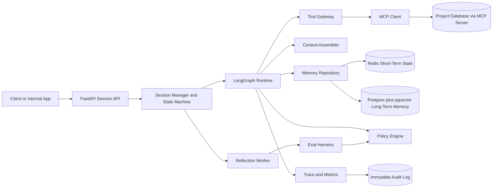

# Agent Platform v2 Complete Build Specification

## 1) Purpose
Build a reusable, company-specific agent platform, not a single agent. The first reusable agents are:
- proposal writing
- project selection through an MCP project database server
- keyword extraction

The platform must be interactive, feedback-driven, secure, reliable, and capable of controlled improvement from human feedback.

## 2) Final Technical Decisions
- Primary orchestration: `LangGraph` in Python.
- Optional later integration: `Semantic Kernel` for plugin/memory abstractions only after v1 is stable.
- LLM provider: `OpenAI` only in v1.
- Deployment: private AWS-hosted environment.
- Integration boundary: MCP server to internal project database; no Slack, Gmail, Jira, or GitHub in v1.
- Safety boundary: no autonomous production code self-modification in v1.

## 3) Target Architecture


Subsystem responsibilities:
- `Session Manager`: validates message protocol, state transitions, idempotency, and ownership.
- `LangGraph Runtime`: agent execution loop, checkpoints, and durable state.
- `Tool Gateway`: all MCP calls, schema validation, permission enforcement, retries, and circuit breakers.
- `Context Assembler`: builds token-bounded model context from structured memory and retrieved evidence.
- `Memory Repository`: separates short-term session state from long-term learned memory.
- `Policy Engine`: external action gating with `allow`, `deny`, and `require_approval`.
- `Reflection Worker`: post-accept learning pipeline with eval and promotion gates.

## 4) Canonical Protocol
### 4.1 Input message types
- `init`: start a session.
- `feedback`: correction, additional context, or rejection.
- `accept`: end active loop and trigger reflection.

### 4.2 Output message types
- `final`: complete result ready for acceptance or feedback.
- `question`: targeted request for missing information.
- `error_retryable`: temporary model/tool/runtime failure.
- `error_policy`: action blocked by policy.
- `error_tool`: MCP/tool failure that needs user or operator action.
- `error_fatal`: unrecoverable session failure.

### 4.3 Required message envelope
```json
{
  "session_id": "uuid",
  "message_id": "uuid",
  "state_version": 1,
  "agent_id": "proposal_writer|project_selector|keyword_extractor",
  "message_type": "init|feedback|accept",
  "payload": {},
  "user_id": "string",
  "nonce": "string",
  "timestamp": "RFC3339"
}
```

### 4.4 State transitions
`NEW -> RUNNING -> WAITING_HUMAN -> RUNNING -> COMPLETED|FAILED`

Rules:
- `init`: `NEW -> RUNNING`
- `question`: `RUNNING -> WAITING_HUMAN`
- `feedback`: `WAITING_HUMAN -> RUNNING`
- `final`: `RUNNING -> WAITING_HUMAN`
- `accept`: `WAITING_HUMAN -> COMPLETED`, then enqueue reflection
- `error_retryable`: remain recoverable with retry budget
- `error_policy`: wait for user/operator approval or changed input
- `error_fatal`: `RUNNING -> FAILED`

## 5) Context and Memory Strategy
Never send the full transcript by default.

Use a four-layer context builder:
1. system invariants: policy, tool constraints, output schemas
2. active working set: latest turns and unresolved items
3. rolling session summary: facts, decisions, constraints, open questions, preferences
4. retrieved evidence chunks: semantic and metadata-filtered prior data

Keep always:
- latest human feedback
- unresolved constraints
- active safety rules
- current accepted output snapshot

Drop first:
- old raw tool payloads
- duplicate drafts
- verbose intermediate traces

Storage split:
- `audit_log`: complete immutable trace, encrypted and retained by policy
- `model_context_log`: compressed runtime context used for prompts

## 6) Confidence and Hallucination Controls
Every `final` and `question` output must include:
- `confidence_score`: number from `0.0` to `1.0`
- `confidence_band`: `low`, `medium`, or `high`
- `confidence_basis`: objective evidence signals

Confidence inputs:
- retrieval coverage and relevance
- unresolved requirement count
- tool-call success ratio
- verifier consistency checks
- historical acceptance for similar cases

Policy by confidence:
- `high`: final output allowed
- `medium`: final output allowed with verification flag
- `low`: final output blocked; return `question` or require review

High-impact factual outputs must enforce source traceability and a no-source-no-claim rule.

## 7) Known Weaknesses and Required Recovery Paths
| Weakness | Failure Mode | Recovery |
|---|---|---|
| Reflection learns from bad feedback | Future outputs drift or degrade | Quarantine candidate changes, require eval pass and approval before promotion |
| Context assembler drops critical information | Agent asks repeated questions or gives wrong final output | Hard-pin latest feedback, unresolved constraints, and accepted snapshots; run context completeness checks |
| MCP server unavailable | Agent cannot fetch project data | Return `error_retryable`, use bounded retry, surface clear user message, and preserve session state |
| MCP tool returns poisoned text | Agent follows malicious retrieved instructions | Treat tool output as data only, strip instruction-like content, enforce policy outside the model |
| Duplicate or replayed messages | Reflection or actions run twice | Enforce `message_id`, `nonce`, `state_version`, and idempotency records |
| Confidence is overestimated | Hallucinated final answer appears reliable | Use objective confidence signals, verifier pass, calibration against acceptance outcomes |
| Eval suite is too small | Improvements pass tests but fail real tasks | Add failed sessions to regression set after review; track eval coverage per agent |
| Memory stores sensitive data | Data leakage or GDPR deletion failure | Classify, redact, encrypt, set TTL, and support deletion/export workflows |
| Too many framework layers | One engineer cannot maintain it | Keep v1 LangGraph-first; add Semantic Kernel only when a concrete repeated integration pain exists |

## 8) Controlled Self-Improvement Lifecycle
After `accept`:
1. extract interaction summary and labeled feedback
2. propose candidate changes to prompts, retrieval, routing, or policy tuning
3. run offline evals and replay tests
4. compare current config against candidate config
5. promote only if quality improves and safety regressions are zero
6. require human approval for medium/high-risk promotions

Forbidden in v1:
- automatic production code edits
- automatic tool permission expansion
- automatic safety policy weakening
- direct memory deletion without audit record

## 9) Agent Template Standard
Each new agent must define:
- mission and success metrics
- strict input and output schema
- allowed MCP tools and scope
- memory policy and retention class
- autonomy level and approval requirements
- eval suite and rollback conditions
- confidence thresholds
- operator escalation path

## 10) Development Phases
### Phase A: Foundation
- FastAPI session API with protocol validation.
- LangGraph runtime with durable checkpoints.
- Tool gateway and MCP connector in read-only mode first.
- Structured tracing and immutable audit logging.
- Context assembler with deterministic token budget.

### Phase B: First Agents
- Project selection agent first.
- Proposal writing agent second.
- Keyword extraction agent third.
- Shared confidence scoring and verifier service.

### Phase C: Learning and Hardening
- Reflection worker and promotion gates.
- Eval harness with regression datasets.
- Security alerting and incident playbooks.
- Data deletion/export workflows for memory.

## 11) AWS Deployment Blueprint
- Private VPC with strict egress control.
- ECS or EKS runtime services behind an internal load balancer.
- AWS Secrets Manager and KMS for key management.
- CloudWatch plus trace backend for observability.
- Encrypted Postgres and Redis with backup policies.

## 12) Definition of Done
The platform is ready for first pilot when:
- all three v1 agents run on the common protocol
- context assembly is token-bounded and deterministic
- confidence-gated output policy is active
- reflection changes require eval pass and approval
- audit logs are complete and tamper-evident
- high-risk MCP actions are blocked or approval-gated
- recovery paths exist for MCP failure, model failure, policy denial, and repeated low-confidence output
