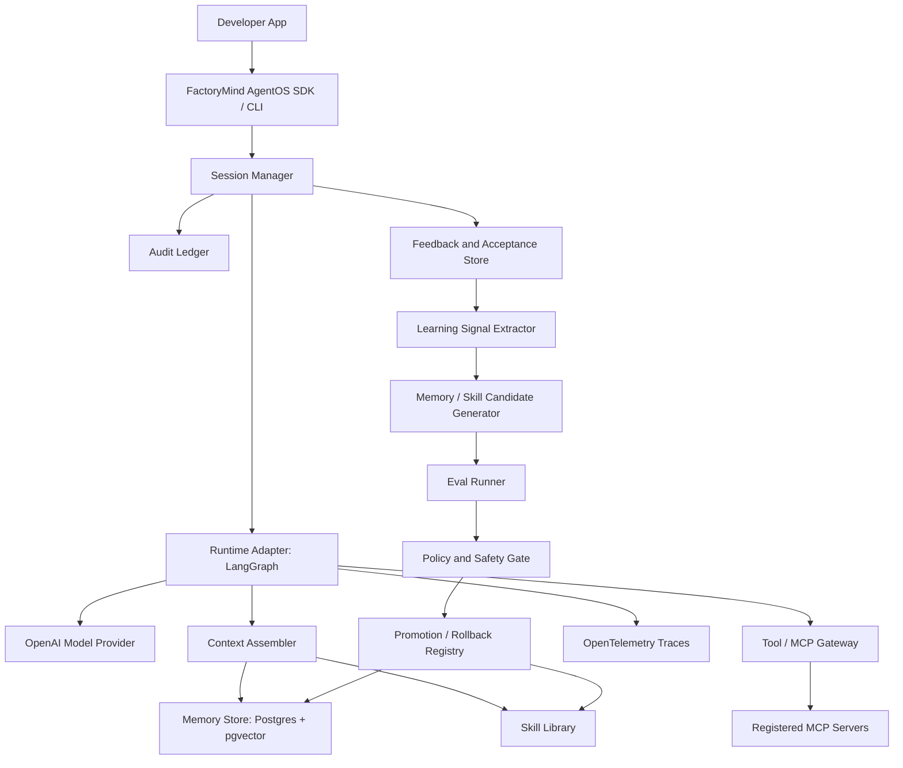

# Build-vs-Wrap Final Recommendation

Access date: 2026-05-01

## 1) Decision Question
Should FactoryMind AgentOS be built from scratch, built on top of one existing platform, or assembled by wrapping stable components behind our own SDK and governance layer?

## 2) Final Answer
Do not build everything from scratch. Do not base the product on a no-code agent app builder.

Recommended V1 strategy:

```text
FactoryMind AgentOS Python package
  owns: SDK, agent manifests, session protocol, policy, memory/skill contract,
        learning engine, promotion gates, audit ledger, MCP gateway contract
  wraps: LangGraph runtime, OpenAI model/tool calling, Postgres/pgvector,
         Redis/queue, OpenTelemetry, Promptfoo/Opik-style eval adapters
  optionally integrates later: Temporal, LangSmith, Phoenix, Letta/Mem0/Zep,
                              Kubernetes, managed cloud agent services
```

FactoryMind AgentOS should be the stable product boundary. LangGraph, OpenAI, eval tools, memory stores, and deployment systems should be replaceable adapters.

## 3) Recommended V1 Stack
| Layer | V1 Choice | Build or Wrap | Reason |
|---|---|---|---|
| Public package | Python `agent-os` SDK + CLI | Build | This is the product surface and must match the FactoryMind AgentOS goal. |
| Agent definition | Python-first definitions + YAML manifests | Build | Needed for reusable company-specific agents and versioning. |
| Runtime/session engine | LangGraph through `AgentRuntimeAdapter` | Wrap | Strong checkpointing, stateful execution, and human-in-the-loop support. |
| LLM provider | OpenAI through `ModelProviderAdapter` | Wrap | User wants OpenAI-only for now; keep provider adapter for later. |
| Tool calling | FactoryMind AgentOS MCP/tool gateway + OpenAI function calling adapter | Build gateway, wrap protocol | Security boundary must be ours; MCP output is untrusted. |
| Memory | Postgres + pgvector, Redis cache | Build schema, wrap storage | Need provenance, deletion, confidence, TTL, and auditability. |
| Skills | FactoryMind AgentOS skill library | Build | This is core self-learning IP. Existing systems do not give the required industrial promotion workflow. |
| Self-learning | Memory + skill candidate engine | Build | Must be gated, auditable, reversible, and per-agent configurable. |
| Evaluation | Built-in eval runner first; Promptfoo/Opik adapters | Build core, wrap tools | Promotion decisions must not depend on a single vendor/tool. |
| Observability | OpenTelemetry traces + FactoryMind AgentOS audit ledger | Wrap OTEL, build audit | OTEL is for debugging; audit ledger is compliance evidence. |
| Policy/governance | Deterministic FactoryMind AgentOS policy pack | Build | Security decisions cannot be delegated to the LLM. |
| Deployment | Docker Compose local; AWS ECS/Fargate production templates | Build templates | Practical for one engineer and industrial enough for early production. |

## 4) Why LangGraph Should Be Wrapped, Not Become the Product
LangGraph is the best V1 runtime candidate, but it should not define FactoryMind AgentOS.

Use LangGraph for:
- graph execution
- checkpoints
- interrupts
- human approval pauses
- resumable workflows
- state transitions

Do not rely on LangGraph for:
- self-learning policy
- skill promotion
- governance decisions
- MCP security boundary
- long-term memory semantics
- audit evidence model
- product-level SDK

Reasoning:
- LangGraph persistence supports checkpoints and human-in-the-loop flows, which maps well to the `init -> question/final/error -> feedback -> accept` protocol.
- FactoryMind AgentOS needs a stronger product contract than a graph framework provides.
- If LangGraph changes pricing, hosting strategy, APIs, or operational assumptions, FactoryMind AgentOS should survive by replacing the runtime adapter.

Primary source: [LangGraph persistence docs](https://docs.langchain.com/oss/python/langgraph/persistence), accessed 2026-05-01.

## 5) Why Not Dify, Flowise, or Other App Builders as the Core
Dify/Flowise-style systems may be useful for inspiration or demos, but they are the wrong core dependency for this goal.

Main reasons:
- FactoryMind AgentOS is intended to be an installable library/package, not a UI-first agent builder.
- Self-learning needs versioned skills, memory candidates, eval gates, promotion, rollback, and audit evidence.
- UI app builders usually constrain runtime internals and make deep governance harder.
- They can create lock-in around their data model, workflow model, plugin model, and deployment shape.

Use them only as:
- comparison products
- UI inspiration
- possible future integration targets

Do not use them as:
- the V1 runtime core
- the source of truth for sessions
- the self-learning engine
- the security boundary

## 6) Why Not Semantic Kernel as the V1 Core
Semantic Kernel is useful, especially for teams already invested in Microsoft/.NET/Azure. It can be a future adapter or enterprise integration path.

For this FactoryMind AgentOS, it should not be the V1 core because:
- the user is Python-first
- the self-learning design needs custom memory/skill promotion semantics
- FactoryMind AgentOS should be provider-agnostic in architecture even if OpenAI-only in V1
- LangGraph maps more directly to checkpointed agent workflows and human-in-the-loop session control

Recommended position:
- `semantic_kernel` adapter: phase 2 or enterprise compatibility layer
- not the primary runtime for V1

## 7) Why Not Temporal as the V1 Agent Runtime
Temporal is strong for durable execution, retries, long-running workflows, and operational resilience. It is not an agent framework.

Use Temporal later for:
- long-running background learning jobs
- scheduled eval/replay jobs
- multi-step production workflows needing durable retries
- high-value customer deployments

Do not use Temporal as the V1 core agent runtime because:
- it adds operational and cognitive complexity
- deterministic workflow constraints are heavy for one engineer
- LangGraph already covers the immediate stateful agent loop better

Recommended position:
- phase 2 durable workflow adapter
- not required for MVP

Primary source: [Temporal durable execution guide](https://assets.temporal.io/durable-execution.pdf), accessed 2026-05-01.

## 8) Why OpenAI Agents SDK Is Not the FactoryMind AgentOS Core
OpenAI Agents SDK is useful for building OpenAI-native agents with tools, handoffs, tracing, and guardrails.

Use OpenAI for:
- model provider
- structured outputs
- function/tool calling
- optional evals
- possible trace grading and prompt optimization experiments

Do not make OpenAI Agents SDK the FactoryMind AgentOS core because:
- FactoryMind AgentOS should own sessions, memory, skill learning, promotion, rollback, audit, and self-host deployment contracts
- the product should avoid hard provider lock-in even if V1 uses only OpenAI models
- MCP/tool security policy must remain in our gateway

Primary sources: [OpenAI Agents SDK docs](https://platform.openai.com/docs/guides/agents-sdk/), [OpenAI function calling docs](https://platform.openai.com/docs/guides/function-calling), [OpenAI agent evals docs](https://platform.openai.com/docs/guides/agent-evals), accessed 2026-05-01.

## 9) Build-vs-Wrap Matrix
| Component | Decision | V1 Detail |
|---|---|---|
| SDK and CLI | Build | `Agent`, `AgentOS`, sessions, feedback, accept, learning commands. |
| Session protocol | Build | `init`, `feedback`, `accept`; outputs: `question`, `final`, `error`. |
| Runtime execution | Wrap | `LangGraphRuntimeAdapter` first. |
| Runtime abstraction | Build | Keep `AgentRuntimeAdapter` from day one. |
| Model provider | Wrap | `OpenAIModelProvider` first. |
| Model abstraction | Build | Keep provider swap possible later. |
| MCP gateway | Build | Registered servers only, allowlists, schema validation, timeouts, audit. |
| Tool execution | Build/wrap | Wrap MCP/OpenAI function calling, but execute through our gateway. |
| Memory store | Build schema, wrap DB | Postgres/pgvector first. |
| Session cache | Wrap | Redis. |
| Skill library | Build | Versioned learned skills, examples, activation rules, risk labels. |
| Learning engine | Build | Signal extraction, candidate generation, eval, promotion, rollback. |
| Prompt optimization | Adapter later | DSPy/TextGrad-style optimizers after datasets exist. |
| Evals | Build minimal, wrap tools | Built-in deterministic eval runner, Promptfoo adapter, Opik adapter. |
| Observability | Wrap | OpenTelemetry for traces/metrics/logs. |
| Audit ledger | Build | Append-only governance and learning evidence. |
| Policy engine | Build initially | Deterministic rules. OPA adapter can come later. |
| Deployment | Build templates | Docker Compose and AWS ECS/Fargate reference. |
| UI | Avoid in V1 | CLI/API first; UI later. |

## 10) V1 Product Boundary
V1 should be an installable Python package that lets a developer:

```text
1. define an agent
2. attach allowed tools/MCP servers
3. attach memory and skills
4. run sessions
5. collect feedback
6. accept final outcomes
7. generate learning candidates from accepted/failed sessions
8. evaluate candidates against regression sets
9. promote safe memory/skill improvements
10. rollback bad improvements
11. audit every step
```

V1 should not promise:
- autonomous code modification
- autonomous permission changes
- autonomous tool creation
- model fine-tuning
- production write actions without approval policies
- multi-tenant SaaS control plane
- full visual no-code builder
- Kubernetes-first operations

## 11) V1 Architecture


## 12) Self-Learning V1 Final Design
Self-learning in V1 means improving only:
- long-term memory
- learned skills
- skill examples
- skill activation metadata
- retrieval/context hints
- evaluation datasets

Self-learning must not improve automatically:
- source code
- tool permissions
- MCP server registration
- security policy
- model weights
- production write-action approval policy

Learning modes:
| Mode | V1 Status | Meaning |
|---|---|---|
| `off` | Required | No learning data stored for improvement. |
| `collect_only` | Required | Store traces and feedback only. |
| `suggest` | Required | Generate candidates, require human promotion. |
| `auto_low_risk` | Required but conservative | Auto-promote only low-risk memory/skill updates after eval pass. |
| `manual_high_risk` | Required | Human approval required for medium/high-risk changes. |

Default rollout:
```text
first deployment: collect_only
when evals exist: suggest
after stability: auto_low_risk for narrow memory/skill updates only
```

## 13) Context Window Failure Fix
The user correctly identified that reflection can fail when the full session does not fit the context window.

V1 fix:
- Store full raw trace outside the LLM context.
- Build a reflection packet instead of sending the full session.
- Preserve human feedback, acceptance, final output, errors, and tool summaries as high-priority items.
- Replace raw tool payloads with compressed tool-call summaries unless the error depends on the payload.
- Use staged summarization for long sessions.
- Keep references back to exact trace/audit IDs for replay.

Reflection packet priority:
```text
1. human feedback
2. accepted/rejected final output
3. agent question/final/error outputs
4. relevant retrieved memories and skills
5. tool call summaries
6. compressed conversation history
7. raw tool payload references, not full payloads
```

## 14) Confidence and Hallucination Control
Every agent output should include confidence metadata, but confidence must not be trusted as proof of correctness.

V1 output schema:
```json
{
  "type": "final",
  "content": "...",
  "confidence": {
    "level": "low|medium|high",
    "score": 0.0,
    "basis": ["retrieved_project_db", "company_skill", "user_feedback"],
    "uncertainties": ["missing budget", "unclear timeline"],
    "requires_human_check": true
  },
  "citations": [],
  "tool_evidence_ids": []
}
```

Rules:
- Low evidence means low confidence.
- Tool/database-backed claims should include evidence IDs.
- Missing required inputs should produce `question`, not hallucinated `final`.
- Confidence should be calibrated through evals and feedback over time.

## 15) Industrial Reliability Requirements
V1 must include:
- durable session state
- checkpointing
- retries with limits
- tool timeouts
- idempotency keys
- queue-backed background learning/eval jobs
- rollback registry
- backup and restore procedure
- audit logs for session, tool, memory, skill, learning, promotion, and rollback events
- versioned agent config
- evals before promotion
- conservative default learning mode

OpenTelemetry should be used for standard traces, metrics, and logs. FactoryMind AgentOS should still own its governance audit ledger.

Primary source: [OpenTelemetry docs](https://opentelemetry.io/docs/), accessed 2026-05-01.

## 16) Security Requirements
V1 must include these controls by default:
- registered MCP servers only
- per-agent tool allowlists
- read-only tools by default
- no direct LLM access to arbitrary MCP servers
- schema validation before tool execution
- output sanitization after tool execution
- prompt-injection treatment for all external data
- secret redaction before LLM context
- immutable or append-only audit events
- approval gates for risky actions
- no automatic permission/policy weakening
- data retention and deletion hooks

MCP-specific rule:
- tool descriptions, tool results, resources, prompts, and remote server content are untrusted input.

Primary source: [MCP security best practices](https://modelcontextprotocol.io/docs/tutorials/security/security_best_practices), accessed 2026-05-01.

Security framework alignment:
- OWASP LLM Top 10: prompt injection, sensitive information disclosure, supply chain, excessive agency, insecure output handling.
- NIST AI RMF: govern, map, measure, manage lifecycle.
- SOC2/GDPR: access control, auditability, data minimization, retention, deletion, incident response.

Primary source: [OWASP Top 10 for LLM Applications 2025](https://genai.owasp.org/resource/owasp-top-10-for-llm-applications-2025), accessed 2026-05-01.

## 17) Recommended Implementation Roadmap
### Phase 0: Product Skeleton
Owner type: AI/platform engineer

Effort: 2-4 days

Dependencies: Python package tooling

Deliver:
- package structure
- CLI skeleton
- Pydantic schemas
- agent manifest
- session protocol schema

### Phase 1: Runtime MVP
Owner type: Python/backend engineer

Effort: 4-7 days

Dependencies: LangGraph, OpenAI API

Deliver:
- `LangGraphRuntimeAdapter`
- `OpenAIModelProvider`
- session init/feedback/accept loop
- output types: question/final/error
- confidence metadata

### Phase 2: Memory + Skills MVP
Owner type: AI/backend engineer

Effort: 5-10 days

Dependencies: Postgres/pgvector, embeddings

Deliver:
- memory schema
- skill schema
- context assembler
- provenance/confidence/TTL/deletion metadata
- basic project selector/proposal writer/keyword extractor examples

### Phase 3: Tool/MCP Gateway
Owner type: backend/security engineer

Effort: 5-10 days

Dependencies: MCP server access to project database

Deliver:
- tool registry
- per-agent permissions
- MCP adapter
- validation, timeout, size limit, sanitization
- tool audit events

### Phase 4: Learning Engine MVP
Owner type: AI engineer

Effort: 7-14 days

Dependencies: accepted session traces, eval cases

Deliver:
- learning signal extraction
- memory candidate generation
- skill candidate generation
- candidate store
- conservative `suggest` mode
- `auto_low_risk` for narrow memory updates only

### Phase 5: Eval + Promotion + Rollback
Owner type: AI/platform engineer

Effort: 7-14 days

Dependencies: eval datasets

Deliver:
- built-in eval runner
- regression tests from accepted/failed sessions
- promotion gate
- rollback registry
- Promptfoo or Opik adapter

### Phase 6: Industrial Operations
Owner type: DevOps/backend engineer

Effort: 5-10 days

Dependencies: Docker, AWS account

Deliver:
- Docker Compose
- AWS ECS/Fargate reference
- RDS/Redis/S3/Secrets templates
- OTEL traces
- backup/restore runbook

## 18) Final Recommendation
Build FactoryMind AgentOS as a code-first Python package that owns the product semantics and wraps existing infrastructure.

Primary V1 stack:
```text
Python SDK/CLI
LangGraph runtime adapter
OpenAI model provider adapter
Postgres + pgvector memory/skill store
Redis cache/queue
FactoryMind AgentOS MCP gateway
FactoryMind AgentOS self-learning engine for memory + skills
Built-in eval runner + Promptfoo/Opik adapters
OpenTelemetry + FactoryMind AgentOS audit ledger
Docker Compose + AWS ECS/Fargate deployment templates
```

Avoid as V1 core:
```text
Dify/Flowise-style app builders
Semantic Kernel as primary runtime
Temporal as primary runtime
Kubernetes-first deployment
autonomous code modification
autonomous policy/permission modification
model fine-tuning
```

The key architectural rule is:

```text
Existing frameworks execute work.
FactoryMind AgentOS decides what is allowed, what is learned, what is promoted, what is rolled back, and what is auditable.
```

## 19) Development Approach
Use spiral development instead of trying to build the whole FactoryMind AgentOS at once.

The first implementation spiral is documented in `docs/17-spiral-development-iteration-1-plan.md`.

Iteration 1 should build only:
- installable Python package skeleton
- typed session protocol
- local SDK and CLI
- local JSON/JSONL event store
- runtime adapter interface
- deterministic local runtime adapter
- typed outputs with confidence metadata
- tests for the session loop

Do not add real MCP, Postgres, Redis, LangGraph, or self-learning until the package/session loop is proven.

