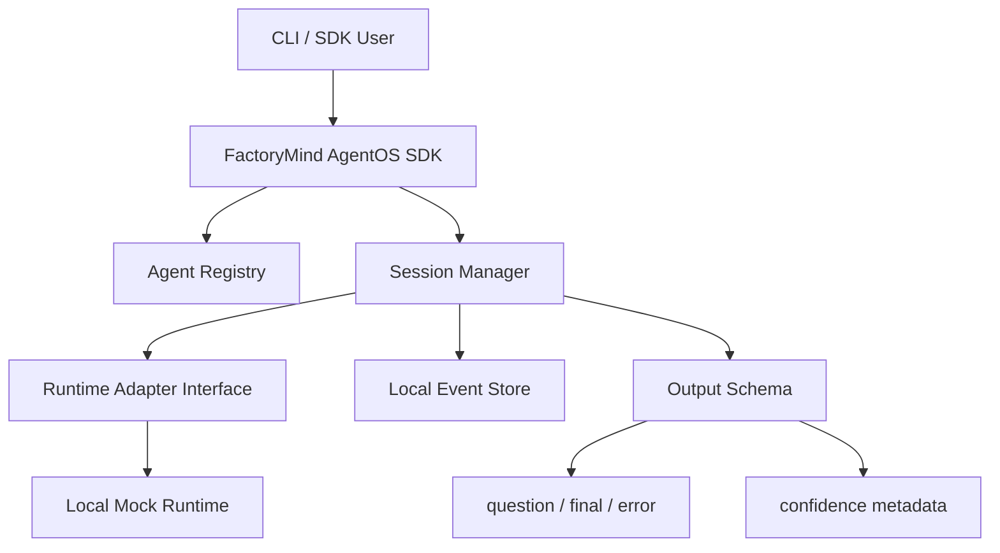

# Spiral Development Plan: Iteration 1

Access date: 2026-05-01

## 1) Purpose
This document converts the FactoryMind AgentOS research package into a spiral development plan.

The goal is not to build the full platform in one pass. The goal is to build a small, working, risk-reducing slice, then expand through repeated spirals.

Each spiral must:
- build something runnable
- expose the biggest unknowns early
- include safety and reliability checks
- create feedback for the next spiral
- avoid irreversible architecture commitments

## 2) Spiral Development Model
Each iteration follows the same loop:

```text
1. Objective
2. Risk focus
3. Minimal design
4. Implementation slice
5. Verification
6. Review and learning
7. Next iteration decision
```

This is a better fit than a waterfall plan because FactoryMind AgentOS has several high-risk areas:
- agent runtime behavior
- session protocol design
- context-window failure
- memory/skill learning quality
- MCP/tool safety
- evaluation reliability
- industrial deployment complexity

## 3) Spiral Roadmap
| Spiral | Theme | Main Question | Output |
|---|---|---|---|
| Iteration 1 | Package + Session Core | Can we install FactoryMind AgentOS and run a controlled agent session? | Runnable SDK/CLI skeleton with local session loop |
| Iteration 2 | Memory + Skills | Can an agent retrieve reusable company behavior safely? | Memory/skill schemas and context assembler |
| Iteration 3 | MCP Tool Gateway | Can the agent safely use a project database tool? | Registered MCP/tool gateway with audit |
| Iteration 4 | Learning Candidates | Can accepted feedback produce memory/skill candidates? | Candidate generator in `suggest` mode |
| Iteration 5 | Eval + Promotion | Can candidates be evaluated, promoted, and rolled back? | Eval runner, promotion gate, rollback registry |
| Iteration 6 | Industrial Runtime | Can it run reliably as a service? | FastAPI service, worker, Docker Compose |
| Iteration 7 | Production Hardening | Can it operate in AWS-like production? | ECS/Fargate reference, observability, backup/restore |

## 4) Iteration 1 Objective
Build the smallest useful FactoryMind AgentOS slice:

```text
pip install -e .
agent-os init
agent-os create agent project_selector
agent-os run project_selector --input "Find the best project for an AI team"
```

Iteration 1 proves:
- the package structure works
- the SDK shape is usable
- the session protocol is correct enough
- outputs can be typed as `question`, `final`, or `error`
- feedback and acceptance events can be stored
- confidence metadata is present
- the architecture can later accept LangGraph, memory, skills, MCP, and learning without rewriting everything

## 5) Iteration 1 Non-Goals
Do not build these yet:
- real MCP integration
- Postgres/pgvector
- Redis queues
- automatic self-learning
- skill promotion
- rollback registry
- FastAPI service
- AWS deployment
- no-code UI
- multi-agent orchestration
- autonomous production actions

Reason:
- these are important, but adding them now hides the core protocol risk
- Iteration 1 should validate the package and session model first

## 6) Iteration 1 Risk Focus
| Risk | Why It Matters | Iteration 1 Control |
|---|---|---|
| Wrong product shape | FactoryMind AgentOS must be a library/package, not one agent | Build installable Python package with SDK and CLI |
| Session protocol mismatch | Future learning depends on clean events | Define typed `init`, `feedback`, `accept` events |
| Output ambiguity | Human loop needs clear states | Define `question`, `final`, `error` output types |
| Hallucinated final answers | Agent may answer without evidence | Require confidence metadata and uncertainty fields |
| Context window failure later | Reflection may not fit full session | Store event history as structured records from day one |
| Runtime lock-in | LangGraph may change or be replaced | Define `AgentRuntimeAdapter` before concrete runtime |
| Learning too early | Unsafe learning can corrupt behavior | Only collect acceptance/feedback events in Iteration 1 |

## 7) Iteration 1 Architecture


Important decision:
- Iteration 1 should use a `LocalRuntimeAdapter` or simple deterministic runtime first.
- LangGraph can be introduced in Iteration 2 or late Iteration 1 only after the protocol is stable.

This avoids mixing package design risk with framework integration risk.

## 8) Iteration 1 Deliverables
### A) Package Skeleton
Owner type: Python/backend engineer

Effort: 0.5-1 day

Deliver:
- `pyproject.toml`
- `src/agent_os/__init__.py`
- package modules
- basic test setup
- editable install support

### B) Core Schemas
Owner type: AI/platform engineer

Effort: 0.5-1 day

Deliver Pydantic models for:
- `AgentDefinition`
- `Session`
- `SessionEvent`
- `InputMessage`
- `FeedbackMessage`
- `AcceptanceMessage`
- `AgentOutput`
- `Confidence`
- `ErrorOutput`
- `LearningMode`

### C) SDK Surface
Owner type: Python/backend engineer

Effort: 0.5-1 day

Deliver:
- `Agent`
- `AgentOS`
- `AgentOS.load()`
- `os.sessions.init(...)`
- `os.sessions.run(...)`
- `os.sessions.feedback(...)`
- `os.sessions.accept(...)`

### D) CLI
Owner type: Python/backend engineer

Effort: 0.5-1 day

Deliver:
- `agent-os init`
- `agent-os create agent <name>`
- `agent-os run <agent> --input "..."`
- `agent-os feedback <session_id> --text "..."`
- `agent-os accept <session_id>`

### E) Local Storage
Owner type: backend engineer

Effort: 0.5 day

Deliver:
- local `.agent-os/` directory
- JSON storage for agents
- JSONL event log for sessions
- no database requirement in Iteration 1

### F) Local Runtime Adapter
Owner type: AI/backend engineer

Effort: 0.5-1 day

Deliver:
- `AgentRuntimeAdapter` interface
- `LocalRuntimeAdapter`
- deterministic placeholder behavior:
  - ask a question if required input is missing
  - produce a final output if sufficient input exists
  - produce error output on invalid state

### G) Tests
Owner type: Python/backend engineer

Effort: 0.5-1 day

Deliver tests for:
- package import
- agent creation
- session init
- session run produces typed output
- feedback appends event
- accept appends event
- event history is replayable
- confidence metadata is always present

## 9) Iteration 1 Acceptance Criteria
Iteration 1 is complete only if:
- `pip install -e .` works
- `agent-os init` creates a valid local workspace
- `agent-os create agent project_selector` creates an agent manifest
- `agent-os run project_selector --input "..."`
  - creates a session
  - appends structured events
  - returns a typed output
  - includes confidence metadata
- feedback can be added to the same session
- acceptance can close the session
- tests pass locally
- no external LLM, database, Redis, or MCP server is required

## 10) Iteration 1 Data Model
Minimum local files:

```text
.agent-os/
  config.json
  agents/
    project_selector.json
  sessions/
    <session_id>.jsonl
```

Minimum session event:

```json
{
  "event_id": "evt_...",
  "session_id": "ses_...",
  "agent_id": "project_selector",
  "type": "input|agent_output|feedback|acceptance|error",
  "created_at": "2026-05-01T00:00:00Z",
  "payload": {},
  "agent_version": "0.1.0"
}
```

Minimum output:

```json
{
  "type": "question|final|error",
  "content": "...",
  "confidence": {
    "level": "low|medium|high",
    "score": 0.0,
    "basis": [],
    "uncertainties": [],
    "requires_human_check": true
  }
}
```

## 11) Iteration 1 Quality Bar
Reliability:
- no silent failures
- every command returns clear success/error output
- invalid session IDs return typed errors
- event writes should be append-only

Security:
- no secrets stored
- no external tool execution
- no arbitrary code execution
- no automatic learning

Maintainability:
- schemas must be typed
- modules must match future architecture
- runtime must sit behind an adapter
- tests must describe intended behavior

## 12) What We Learn From Iteration 1
At the end of Iteration 1, review:
- Is the `init -> run -> feedback -> accept` loop natural?
- Are `question`, `final`, and `error` enough output types?
- Does confidence metadata feel useful or noisy?
- Is local JSON/JSONL enough for early dev?
- Does the CLI match how future users will actually build agents?
- Is the SDK simple enough for proposal writer, project selector, and keyword extractor agents?

## 13) Next Iteration Gate
Move to Iteration 2 only when Iteration 1 proves the package/session loop.

Iteration 2 should add:
- memory schema
- skill schema
- context assembler
- simple skill retrieval
- no automatic promotion yet

Do not add MCP before memory/skills unless the project database integration becomes the highest-risk dependency.

## 14) Implementation Order
Recommended order:

```text
1. create package skeleton
2. add Pydantic protocol schemas
3. add local storage
4. add SDK session manager
5. add local runtime adapter
6. add Typer CLI
7. add tests
8. run end-to-end CLI smoke test
9. review protocol gaps
```

## 15) Iteration 1 Final Scope Statement
Iteration 1 builds the FactoryMind AgentOS shell and session heart.

It does not make agents intelligent yet. It makes the platform shape real, testable, and safe to extend.

## 16) Implementation Status
Status: implemented as initial Iteration 1 slice.

Implemented files:
- `pyproject.toml`
- `README.md`
- `src/agent_os/protocol/models.py`
- `src/agent_os/storage/local.py`
- `src/agent_os/runtime/base.py`
- `src/agent_os/runtime/local.py`
- `src/agent_os/sessions/manager.py`
- `src/agent_os/sdk.py`
- `src/agent_os/cli/app.py`
- `tests/test_iteration_1.py`

Verified:
- `python -m pip install -e ".[dev]"` passes.
- `python -m pytest -q` passes.
- CLI smoke flow passes:
  - `agent-os init`
  - `agent-os create agent project_selector`
  - `agent-os run project_selector --input "..."`

Current intentional limitation:
- runtime is deterministic `LocalRuntimeAdapter`, not LangGraph or OpenAI.
- storage is local JSON/JSONL, not Postgres.
- learning is not active; only feedback and acceptance events are captured.

## 17) Iteration 2 Link
Iteration 2 is documented in `docs/18-spiral-development-iteration-2-plan.md`.

Iteration 2 adds:
- local memory
- local skills
- deterministic context assembly
- SDK and CLI commands for memory/skills/context

