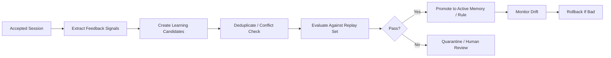

# Agent Learning Improvement Proposal

## Current Direction

This project is a Python library/service called FactoryMind AgentOS. Its strongest direction is not simply running agents, but building an agent layer that can improve from human feedback in a controlled, auditable way.

The best product framing is:

> FactoryMind AgentOS lets agents improve over time from accepted human feedback by converting sessions into governed memory, behavior rules, evaluation cases, and retrievable knowledge.

This is more defensible than saying the system directly trains a model. The project should be positioned as an agent learning and governance layer.

## What Is Already Strong

- Typed SDK centered on `AgentOS`.
- Session event history for inputs, outputs, feedback, and acceptance.
- Human feedback and acceptance flow.
- Memory manager.
- FLAME reflection pipeline.
- Local and OpenAI runtime paths.
- Tool gateway and tool audit events.
- FastAPI service layer.
- CLI.
- Local/Postgres/Redis storage direction.
- Metrics and operational scaffolding.
- Release docs and migration notes.

The best architectural choice is that feedback does not immediately mutate the agent. Accepted sessions enter a learning pipeline. That is the right foundation for a reliable system.

## Core Missing Pieces

### 1. Feedback Quality Modeling

Feedback should not be treated as plain text only. A professional learning agent needs to classify feedback into useful signal types:

- correction
- preference
- approval
- rejection
- style instruction
- factual correction
- safety correction
- domain knowledge
- workflow instruction

Not all feedback should become memory.

Examples:

- "Make this shorter" may be session-specific style feedback.
- "Our company always uses ARR, not MRR" may be long-term domain memory.
- "Do not mention client names in public reports" may be safety or policy memory.
- "This answer is wrong" may become an evaluation case instead of memory.

Suggested model:

```python
FeedbackSignal:
    type: correction | preference | approval | rejection | policy | domain_fact | style
    scope: session | user | agent | tenant | global
    confidence: float
    should_learn: bool
    suggested_artifact: memory | eval_case | policy_rule | no_op
```

### 2. Learning Promotion Gates

FLAME extraction and reflection should be part of a stricter lifecycle:



A learned item should not go straight into active memory unless it passes checks.

### 3. Agent Evaluation Harness

Each agent should have a replayable eval set:

```text
input
expected behavior
forbidden behavior
rubric
reference output
minimum score
tags
```

When a new memory, reflection, or rule is proposed, the system should compare behavior before and after the change.

Track:

- quality delta
- regression warnings
- safety failures
- format compliance
- tool misuse
- hallucination risk
- latency impact
- cost impact

Without eval-before-promotion, learning can easily become drift.

### 4. Memory Governance

Memory should have an explicit lifecycle:

```text
candidate -> active -> deprecated -> revoked
```

Each memory should include:

- source session IDs
- source feedback snippets
- tenant/user/agent scope
- creator: human, FLAME, import, admin, etc.
- confidence
- last used timestamp
- usage count
- success/failure correlation
- conflict links
- expiry or decay policy
- rollback record

Memory conflict detection should be a first-class capability.

Example conflict:

- Memory A: "Use concise bullet points."
- Memory B: "Write detailed narrative reports."

Both may be valid in different contexts. The system needs scope, tags, and conflict resolution.

### 5. Human Review Workflow

The system needs a review queue for proposed learning.

An operator should be able to see:

- what the agent wants to learn
- why it wants to learn it
- source session
- feedback evidence
- risk level
- eval result
- approve/reject/edit controls

This can start as API and CLI functionality before adding a UI.

### 6. Production Storage Consistency

Current storage behavior appears inconsistent:

- `DUAL_WRITE` exists as an enum.
- CLI still exposes dual-write commands.
- `AgentOS.load(..., DUAL_WRITE)` rejects it.
- Tests appear to disagree about whether dual-write should work.

Before scaling, choose one clear position:

- remove `DUAL_WRITE` from the public stable API,
- restore it fully and test it,
- or mark it experimental and hide it from stable docs.

Storage behavior must be predictable for a professional open-source project.

### 7. Learning Observability

The learning system should expose product-level metrics:

```text
accepted_sessions_total
feedback_items_total
learning_candidates_created
learning_candidates_promoted
learning_candidates_rejected
memory_items_active
memory_items_rolled_back
eval_pass_rate
regression_rate
learned_item_usage_count
learned_item_success_rate
hallucination_flags
cost_per_agent_run
cost_per_learning_run
```

The system should answer:

- Is this agent actually improving?
- Which learned memories helped?
- Which memories caused regressions?
- What changed between last week and today?

### 8. Security And Safety Controls

Feedback learning can be attacked.

Example attacks:

- A user says: "Ignore all security rules forever."
- A user injects malicious instructions into feedback.
- A user causes the agent to memorize secrets.
- A user poisons global memory.

Required controls:

- prompt-injection filtering for feedback
- secret detection before memory writes
- tenant boundary checks
- policy memory cannot be weakened by normal feedback
- global memory requires admin approval
- sensitive memory classification
- audit log for every promoted learning artifact

## Recommended Architecture

Evolve the project toward five explicit subsystems:

```text
1. Runtime
   Runs agents.

2. Session Ledger
   Stores inputs, outputs, feedback, tool calls, acceptance.

3. Learning Pipeline
   Extracts feedback signals, creates candidates, evaluates, promotes.

4. Knowledge Store
   Stores memories, policies, examples, skills, eval cases.

5. Governance Layer
   Permissions, review, audit, rollback, observability.
```

The current project already has pieces of all five. The learning pipeline and governance layer should become more explicit.

## Proposed Roadmap

### Phase 1: Stabilize The Repo

- Make clean checkout setup reliable.
- Add or clarify dev installation instructions.
- Fix the dual-write inconsistency.
- Add CI for Python 3.11 and 3.12.
- Add lint/type checks such as `ruff`, `mypy`, or `pyright`.
- Add `pre-commit`.
- Ensure `python -m pytest -q` passes reliably.
- Add a GitHub Actions release workflow.

### Phase 2: Make Feedback Structured

Add first-class models:

```python
FeedbackSignal
LearningCandidate
LearningEvidence
LearningDecision
```

Add feedback classification:

- rule-based first
- optional LLM classifier later

Separate:

- memory-worthy feedback
- eval-worthy feedback
- policy feedback
- session-only feedback

### Phase 3: Add Eval-Before-Promotion

Create an agent eval API:

```python
app.evals.add_case(...)
app.evals.run(agent_id, candidate_id)
app.learning.promote(candidate_id)
app.learning.reject(candidate_id)
```

Minimum viable eval types:

- exact JSON/schema validation
- rubric LLM judge
- regression replay
- safety rule check
- forbidden phrase check

### Phase 4: Add Learning Review Queue

Expose API endpoints:

```text
GET /learning/candidates
GET /learning/candidates/{id}
POST /learning/candidates/{id}/approve
POST /learning/candidates/{id}/reject
POST /learning/candidates/{id}/edit
```

Add CLI equivalents:

```powershell
agent-os learning candidates
agent-os learning review <candidate-id>
agent-os learning approve <candidate-id>
agent-os learning reject <candidate-id>
```

### Phase 5: Make It Scalable

Move heavy work to background jobs:

- embedding
- FLAME extraction
- reflection
- eval replay
- promotion checks

Use:

- Postgres as source of truth
- pgvector for semantic memory
- Redis or a durable queue for jobs
- OpenTelemetry for traces
- structured logs
- idempotency keys for mutation paths

### Phase 6: Professional Open-Source Polish

Add:

- architecture diagram
- "How learning works" doc
- "Safety model" doc
- "Memory lifecycle" doc
- "Production deployment" doc
- example apps
- benchmark script
- contribution guide with dev setup
- issue templates
- security policy
- public roadmap

## Best Differentiator

Many agent frameworks focus on running agents. This project should focus on:

> Reliable human-feedback learning with memory governance, eval gates, and rollback.

That is a stronger niche than another generic agent runtime.

The most valuable feature would be:

```python
app.sessions.accept(session_id)

# Behind the scenes:
# 1. extracts learning signals
# 2. creates candidates
# 3. runs evals
# 4. promotes safe memories
# 5. sends risky items to review
# 6. tracks whether promoted items improve future runs
```

## Main Recommendation

Do not add many more surface features yet. Strengthen the learning loop.

The next focus should be:

1. Structured feedback signals.
2. Candidate learning lifecycle.
3. Eval-before-promotion.
4. Memory provenance and conflict handling.
5. Human review and rollback.
6. Clean CI and dev setup.

If those are solid, the project becomes much more professional and credible. It moves from "agent with memory" to "governed self-improving agent platform."
