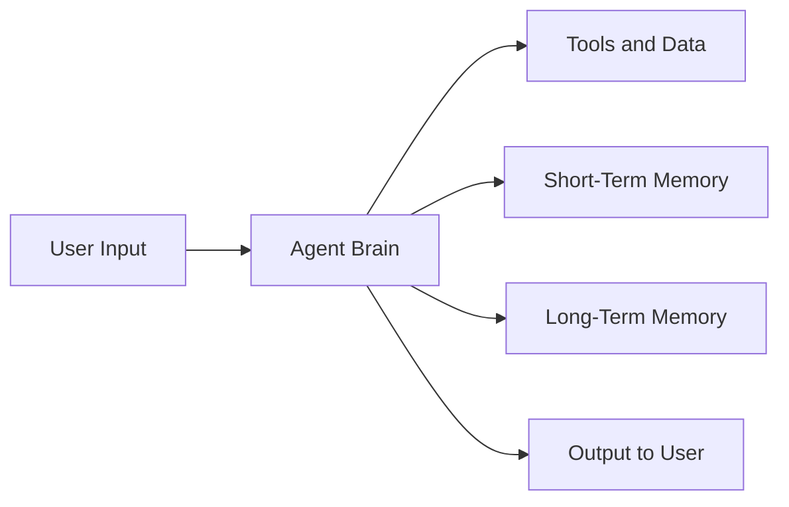
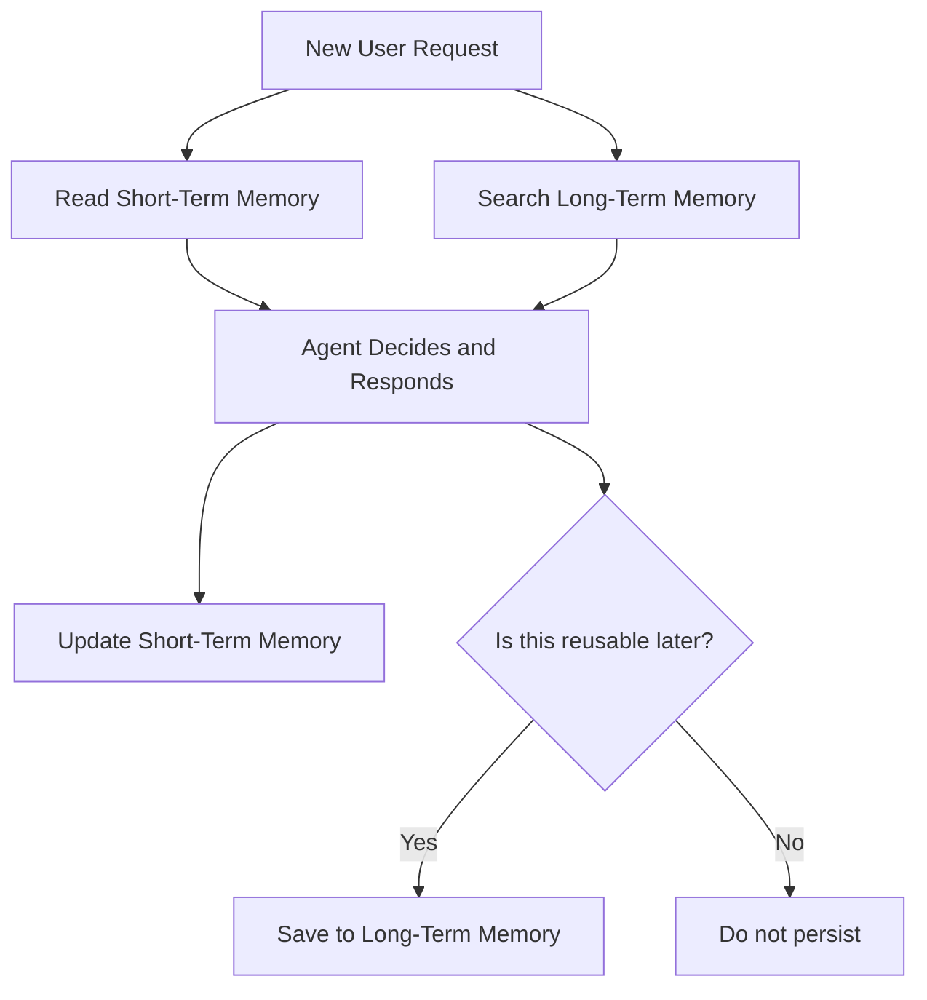

# Simple AI Agent Architecture Report (Non-Technical)

## 1) What this agent does
An AI agent takes a request, uses available context and memory, decides on the next best action, and returns a useful response.

In plain language:
- **Input:** What a person asks + current context
- **Processing:** Understand, decide, retrieve, generate
- **Output:** A response, recommendation, or action

## 2) Simple architecture (high level)

### What each block means
- **User Input:** Question, task, instruction, or file
- **Agent Brain:** Interprets intent and chooses next steps
- **Tools and Data:** APIs, documents, systems, databases
- **Short-Term Memory:** Temporary context for this conversation
- **Long-Term Memory:** Persisted knowledge across conversations
- **Output to User:** Final answer, summary, or completed task

## 3) Input and output (simple view)

| Stage | Examples |
|---|---|
| Input to agent | User message, uploaded file, business context, current date/time |
| Output from agent | Answer, draft email, report, plan, extracted insights, triggered workflow |

## 4) How short-term memory works
Short-term memory is the agent's **working memory** during the active interaction.

It usually stores:
- The latest user goals
- Key facts shared in this thread
- Intermediate reasoning steps
- Temporary tool results

Key behavior:
- Fast and contextual
- Updated continuously during the session
- Usually resets when the session ends

## 5) How long-term memory works
Long-term memory stores reusable information beyond one session.

It usually stores:
- Stable user/team preferences
- Important business facts that remain valid
- Past decisions and outcomes
- Reusable project knowledge

Key behavior:
- Persistent across sessions
- Retrieved when relevant
- Updated selectively (not every message)

## 6) Memory lifecycle visualization

## 7) Example (non-technical)
1. User asks: "Prepare a weekly sales summary for leadership."
2. Agent uses short-term memory to keep current instructions (tone, audience, deadline).
3. Agent uses long-term memory to recall preferred report format and past KPI definitions.
4. Agent outputs a leadership-ready summary.
5. Agent stores only reusable patterns (e.g., preferred template), not every temporary detail.

## 8) Why this matters for the business
- Better consistency in responses
- Less repeated instruction from teams
- Faster execution on recurring tasks
- Improved personalization with controlled persistence

## 9) Governance recommendation (simple)
For safe adoption:
- Define what can and cannot be saved to long-term memory
- Set retention and deletion rules
- Add human review for high-impact outputs
- Track quality with basic metrics (accuracy, speed, user satisfaction)
